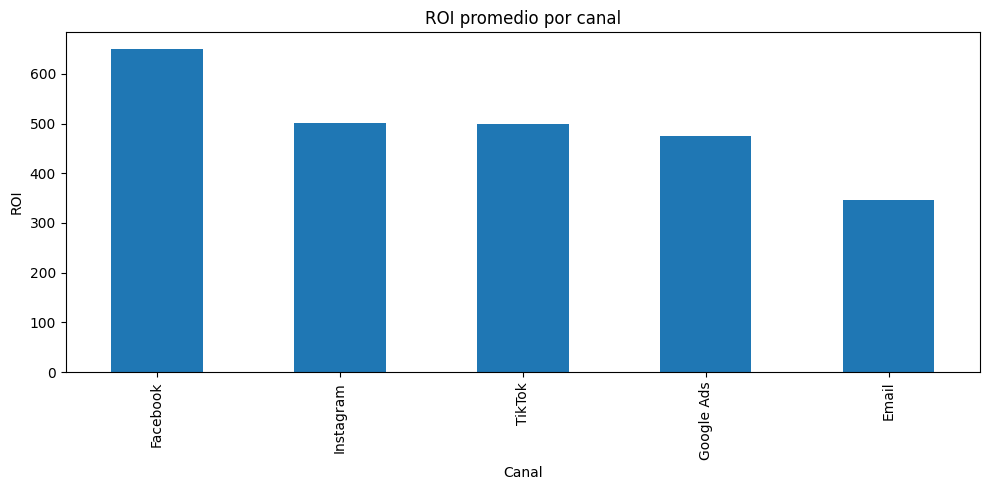
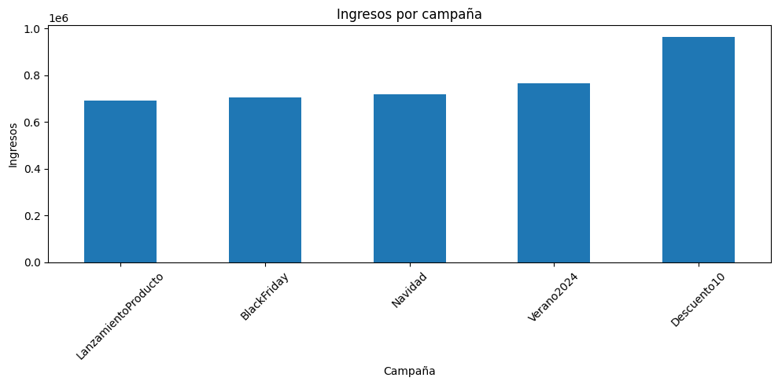
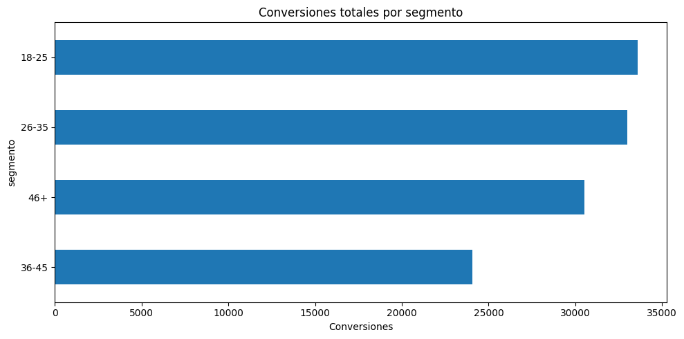

# Digital Marketing Campaign Performance Analysis

## Objective
Evaluate the performance of digital marketing campaigns using key business metrics such as CTR, conversion rate, ROI, and CPA to identify the most profitable channels, campaigns, and age segments.

## Dataset
Simulated dataset including:
- Impressions  
- Clicks  
- Conversions  
- Spend  
- Revenue  
- Channel  
- Campaign  
- Age segment  

## Process
- Data cleaning and validation  
- Feature engineering (business metrics)  
- Analysis by channel, campaign, and segment  
- Time-based revenue analysis  
- Data visualization  

## Key Findings
- Identification of the channel with the highest average ROI  
- Campaigns with the best conversion rates  
- Most profitable age segment  
- Most profitable channel–campaign combinations  

## Business Impact
This analysis can be used to optimize marketing budget allocation, improve campaign performance, and refine audience targeting strategies.

## Notebook

You can find the full analysis in the Jupyter Notebook here:  
[Open notebook](campaign_analysis.ipynb)

## Visualizations

### ROI by Channel
This visualization shows the average ROI for each marketing channel. Channels such as Facebook, Instagram, and TikTok deliver the highest ROI, suggesting they are more cost-effective for budget allocation.

### Revenue by Campaign
This bar chart illustrates total revenue by campaign type. Discount-based campaigns like “Descuento10” drive the most revenue, while product launch campaigns perform lower.

### Conversions by Age Segment
Here we see total conversions distributed by age group. Younger segments (18–35) generate the most conversions, indicating stronger engagement and interest from these audiences.

## Business Recommendations

- Allocate more budget to high-ROI channels like Facebook, Instagram, and TikTok.
- Focus promotional campaigns (e.g., discounts) on younger segments (18–35) for higher conversions and revenue.
- Reevaluate underperforming campaigns to discover potential messaging or targeting improvements.
- Consider optimizing email marketing with personalization to improve ROI.

## Conclusion

By evaluating key performance indicators (CTR, conversion rate, ROI, and CPA), this analysis identifies the most effective marketing channels, campaigns, and audience segments. These insights can serve as a foundation for better budget allocation and strategic marketing decisions.

